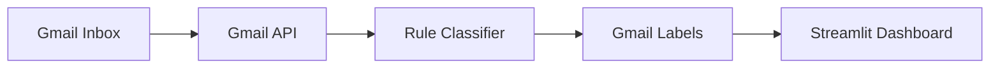

# 📧 Gmail AI Cleaner

Open-source Gmail productivity tool built with Python, Gmail API, and Streamlit.

Automatically classifies emails into Spam, Newsletter, and Important categories, applies Gmail labels, and provides an interactive dashboard for inbox management.

---

## 📸 Dashboard


---

## 🚀 Features

### 📬 Gmail Integration

* Gmail API Integration
* OAuth2 Authentication
* Secure Gmail Access

### 🏷 Automatic Labels

Automatically creates and manages:

* AI-Spam
* AI-Newsletter
* AI-Important

### 🧠 Email Classification

Rule-based email classification:

* 🚫 Spam Detection
* 📰 Newsletter Detection
* ✅ Important Email Detection

### 🌐 Dashboard

Interactive Streamlit dashboard:

* Email Statistics
* Category Distribution Chart
* Search Functionality
* Category Filtering
* Classification Results
* Spam Cleanup
* Newsletter Archive
* Dashboard Refresh

---

## 🏗 Architecture



---

## 📂 Project Structure

```text
gmail-ai-cleaner/

├── app.py
├── gmail_cleaner.py
├── spam_rules.py
├── label_helper.py
├── actions.py
├── requirements.txt
├── README.md
└── screenshots/
    └── dashboard.png
```

---

## ⚙️ Installation

Clone the repository:

```bash
git clone https://github.com/chunchiech/gmail-ai-cleaner.git

cd gmail-ai-cleaner
```

Install dependencies:

```bash
pip install -r requirements.txt
```

---

## 🔑 Gmail API Setup

Before running Gmail AI Cleaner:

1. Create a Google Cloud Project
2. Enable Gmail API
3. Create an OAuth Desktop Application
4. Download `credentials.json`
5. Place it in the project root directory

Example:

```text
gmail-ai-cleaner/

├── credentials.json
├── app.py
└── ...
```

On first launch, Google Login will open automatically.

After successful authorization:

```text
token.json
```

will be generated automatically.

---

## ▶️ Run

Launch the dashboard:

```bash
streamlit run app.py
```

Open:

```text
http://localhost:8501
```

---

## 📊 Example Results

```text
Spam: 2
Newsletter: 2
Important: 16
```

Generated Gmail Labels:

```text
AI-Spam
AI-Newsletter
AI-Important
```

---

## 🔒 Security

Do NOT commit:

```text
credentials.json
token.json
.env
```

Recommended `.gitignore`:

```gitignore
credentials.json
token.json
.env
venv/
__pycache__/
```

---

## 🗺 Roadmap

### v1.0.0

* [x] Gmail API Integration
* [x] OAuth Authentication
* [x] Email Classification
* [x] Gmail Label Automation
* [x] Streamlit Dashboard
* [x] Statistics Dashboard
* [x] Search & Filtering

### v1.1.0

* [x] Spam Cleanup
* [x] Newsletter Archive

### v1.2.0

* [ ] AI-Processed Label
* [ ] Scan New Emails Only

### v2.0.0

* [ ] AI Email Classification
* [ ] Email Summarization
* [ ] Daily Digest Report

### v3.0.0

* [ ] Docker Support
* [ ] GitHub Actions Automation
* [ ] Streamlit Cloud Deployment

---

## 🤝 Contributing

Contributions, suggestions, and feature requests are welcome.

Feel free to open an issue or submit a pull request.

---

## 📄 License

MIT License

---

Built with ❤️ using Python, Gmail API, and Streamlit.

