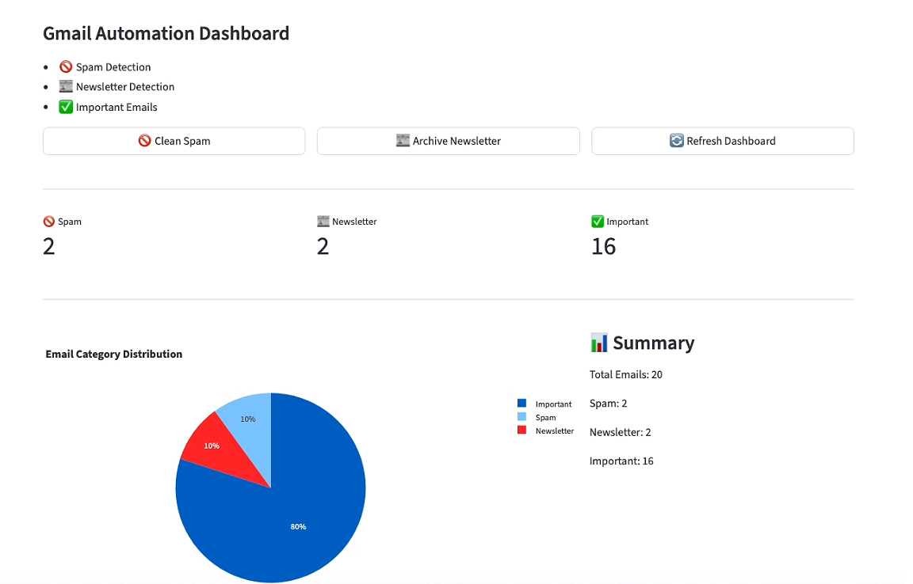

# 📧 Gmail AI Cleaner

A Gmail automation tool built with Python, Gmail API, and Streamlit.

Automatically classifies emails into:

* 🚫 Spam
* 📰 Newsletter
* ✅ Important

and applies Gmail labels automatically.

---

## 📸 Dashboard



---

## 🚀 Features

### 📬 Gmail Integration

* Gmail API integration
* OAuth2 authentication
* Secure access to Gmail account

### 🏷 Auto Labeling

Automatically creates and manages:

* AI-Spam
* AI-Newsletter
* AI-Important

### 🧠 Email Classification

Rule-based classification engine:

* Spam detection
* Newsletter detection
* Important email detection

### 🌐 Streamlit Dashboard

Interactive web dashboard:

* Scan Gmail mailbox
* Search emails
* Filter by category
* Email statistics
* Pie chart visualization

---

## 🛠 Tech Stack

* Python
* Gmail API
* Google OAuth2
* Streamlit
* Pandas
* Plotly

---

## 📂 Project Structure

```text
gmail-ai-cleaner/

├── app.py
├── gmail_cleaner.py
├── spam_rules.py
├── label_helper.py
├── requirements.txt
├── README.md
└── screenshots/
    └── dashboard.png
```

---

## ⚙️ Installation

```bash
git clone https://github.com/chunchiech/gmail-ai-cleaner.git

cd gmail-ai-cleaner

pip install -r requirements.txt
```

---

## 🔑 Gmail API Setup

1. Create a Google Cloud Project
2. Enable Gmail API
3. Create OAuth Desktop Application
4. Download `credentials.json`
5. Place it in the project root

Example:

```text
gmail-ai-cleaner/
├── credentials.json
├── app.py
└── ...
```

---

## ▶️ Run

```bash
streamlit run app.py
```

Open browser:

```text
http://localhost:8501
```

---

## 📊 Example Output

```text
Spam: 2
Newsletter: 2
Important: 16
```

Generated Labels:

```text
AI-Spam
AI-Newsletter
AI-Important
```

---

## 🔒 Security

Never commit:

```text
credentials.json
token.json
.env
```

Recommended `.gitignore`:

```gitignore
credentials.json
token.json
.env
venv/
__pycache__/
```

---

## 🗺 Roadmap

### v1.0

* [x] Gmail API Integration
* [x] OAuth Authentication
* [x] Email Classification
* [x] Gmail Labels
* [x] Streamlit Dashboard

### v1.1

* [ ] Spam Cleanup Button
* [ ] Newsletter Archive
* [ ] Processed Email Tracking

### v2.0

* [ ] AI Classification
* [ ] Email Summarization
* [ ] Daily Digest Report

### v3.0

* [ ] Docker Support
* [ ] GitHub Actions Automation
* [ ] Streamlit Cloud Deployment

---

## 📄 License

MIT License

---

Built with ❤️ using Python, Gmail API, and Streamlit.

